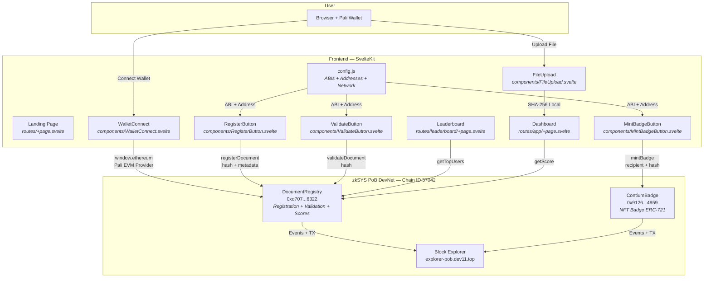
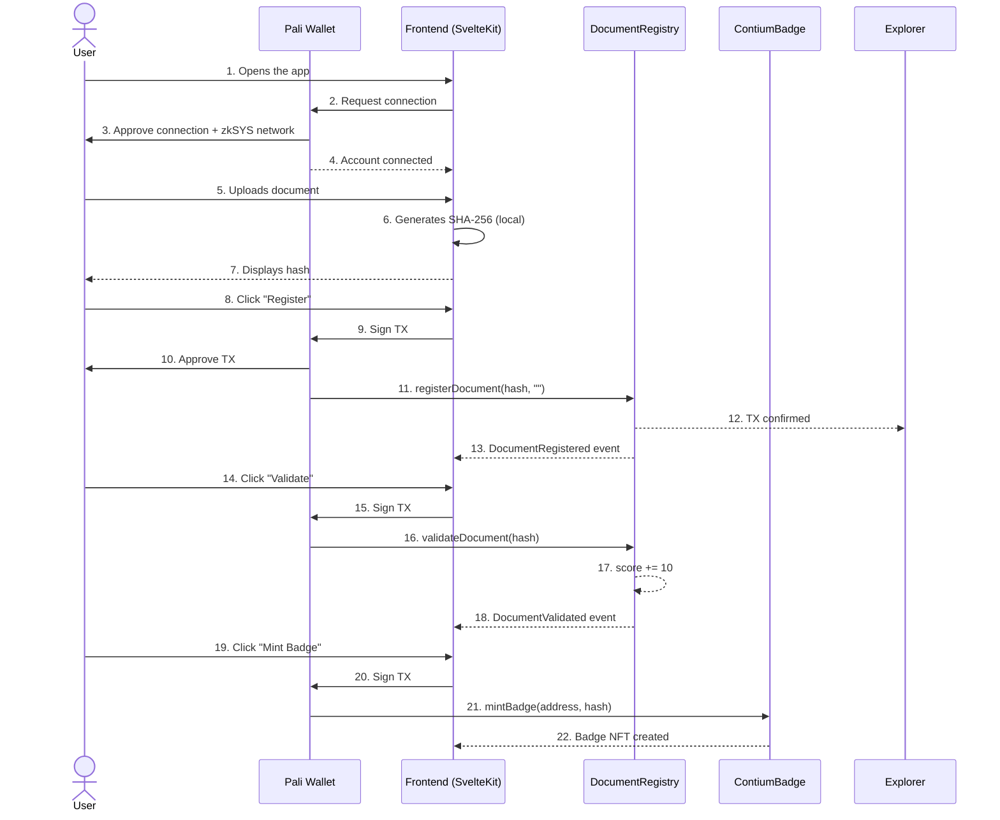

# System Architecture — Contium

## General Diagram

## Data Flow

## Main Components

### Smart Contracts

| Contract | Main Functions | Events |
|----------|---------------|--------|
| **DocumentRegistry** | `registerDocument(hash, metadata)` | `DocumentRegistered(hash, owner, timestamp)` |
| | `validateDocument(hash)` | `DocumentValidated(hash, owner, newScore)` |
| | `getDocument(hash)` returns DocumentInfo | |
| | `getScore(address)` returns uint256 | |
| | `getTopUsers(limit)` returns address[], uint256[] | |
| | `isRegistered(hash)` returns bool | |
| | `isValidated(hash)` returns bool | |
| **ContiumBadge** | `mintBadge(recipient, documentHash)` | `Transfer(from, to, tokenId)` |
| | `balanceOf(address)` returns uint256 | |
| | `tokenURI(tokenId)` returns string | |

### Frontend

| Component | Responsibility |
|-----------|---------------|
| **WalletConnect.svelte** | Pali Wallet connection, network detection, modal to add zkSYS |
| **FileUpload.svelte** | File upload and local SHA-256 hash generation |
| **RegisterButton.svelte** | Calls `registerDocument()` on the contract |
| **ValidateButton.svelte** | Calls `validateDocument()` on the contract |
| **MintBadgeButton.svelte** | Calls `mintBadge()` on ContiumBadge |
| **TxConfirmation.svelte** | Transaction confirmation progress bar (1/5 to 5/5 blocks) |
| **InstructionPanel.svelte** | Step-by-step instruction panel for user guidance |
| **config.js** | Centralized configuration: network, addresses, ABIs |

## Network Configuration

| Parameter | Value |
|-----------|-------|
| **Chain ID** | 57042 (0xDED2) |
| **Network** | zkSYS PoB DevNet |
| **RPC** | https://rpc-pob.dev11.top |
| **Explorer** | https://explorer-pob.dev11.top |
| **Native Token** | TSYS (18 decimals) |
| **Wallet** | Pali Wallet v2 (EVM mode) |