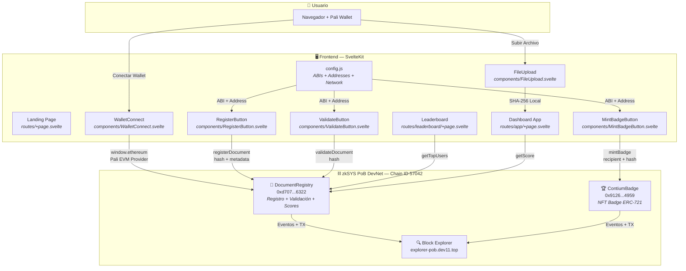
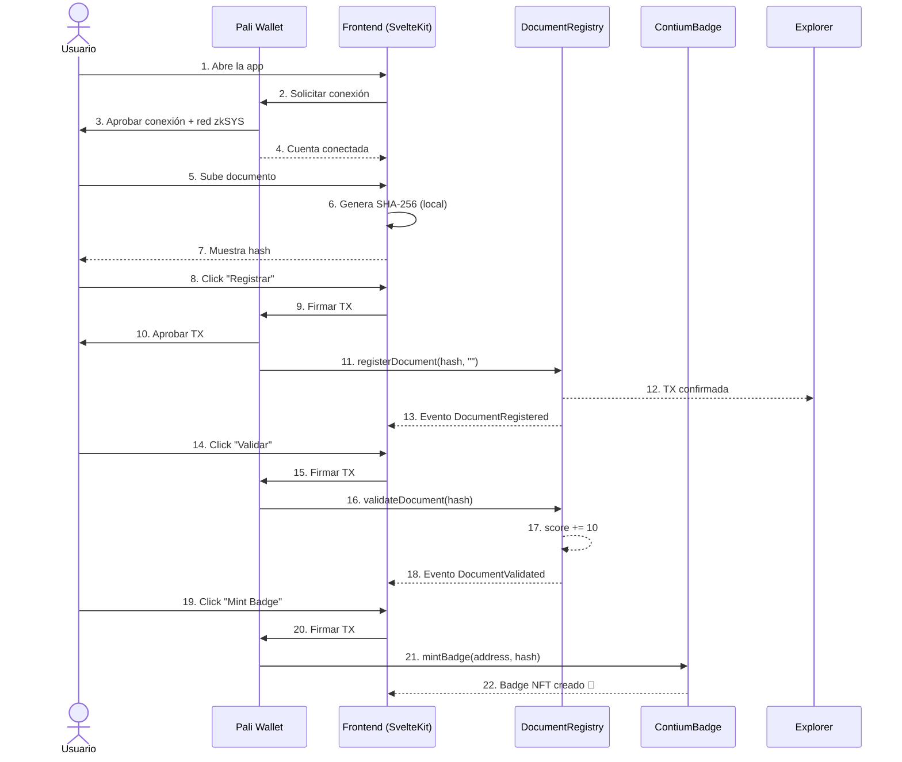

# 🏗️ Arquitectura del Sistema — Contium

## Diagrama General

## Flujo de Datos

## Componentes Principales

### Smart Contracts

| Contrato | Funciones Principales | Eventos |
|----------|----------------------|---------|
| **DocumentRegistry** | `registerDocument(hash, metadata)` | `DocumentRegistered(hash, owner, timestamp)` |
| | `validateDocument(hash)` | `DocumentValidated(hash, owner, newScore)` |
| | `getDocument(hash)` → DocumentInfo | |
| | `getScore(address)` → uint256 | |
| | `getTopUsers(limit)` → address[], uint256[] | |
| | `isRegistered(hash)` → bool | |
| | `isValidated(hash)` → bool | |
| **ContiumBadge** | `mintBadge(recipient, documentHash)` | `Transfer(from, to, tokenId)` |
| | `balanceOf(address)` → uint256 | |
| | `tokenURI(tokenId)` → string | |

### Frontend

| Componente | Responsabilidad |
|-----------|----------------|
| **WalletConnect.svelte** | Conexión con Pali Wallet, detección de red, modal para agregar zkSYS |
| **FileUpload.svelte** | Subida de archivo y generación de hash SHA-256 local |
| **RegisterButton.svelte** | Llamada a `registerDocument()` en el contrato |
| **ValidateButton.svelte** | Llamada a `validateDocument()` en el contrato |
| **MintBadgeButton.svelte** | Llamada a `mintBadge()` en ContiumBadge |
| **config.js** | Configuración centralizada: network, addresses, ABIs |

## Configuración de Red

| Parámetro | Valor |
|-----------|-------|
| **Chain ID** | 57042 (0xDED2) |
| **Red** | zkSYS PoB DevNet |
| **RPC** | https://rpc-pob.dev11.top |
| **Explorer** | https://explorer-pob.dev11.top |
| **Token Nativo** | TSYS (18 decimales) |
| **Wallet** | Pali Wallet v2 (EVM mode) |