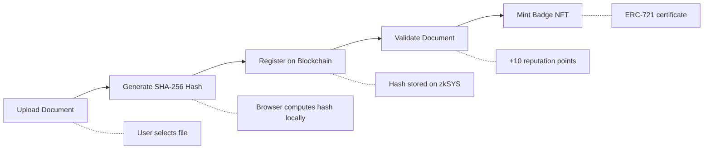
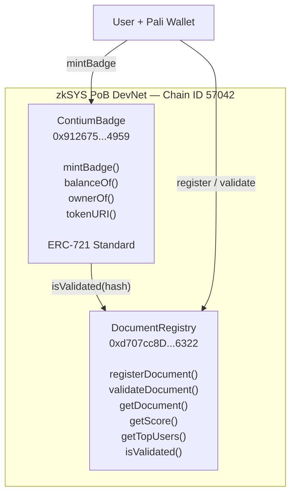
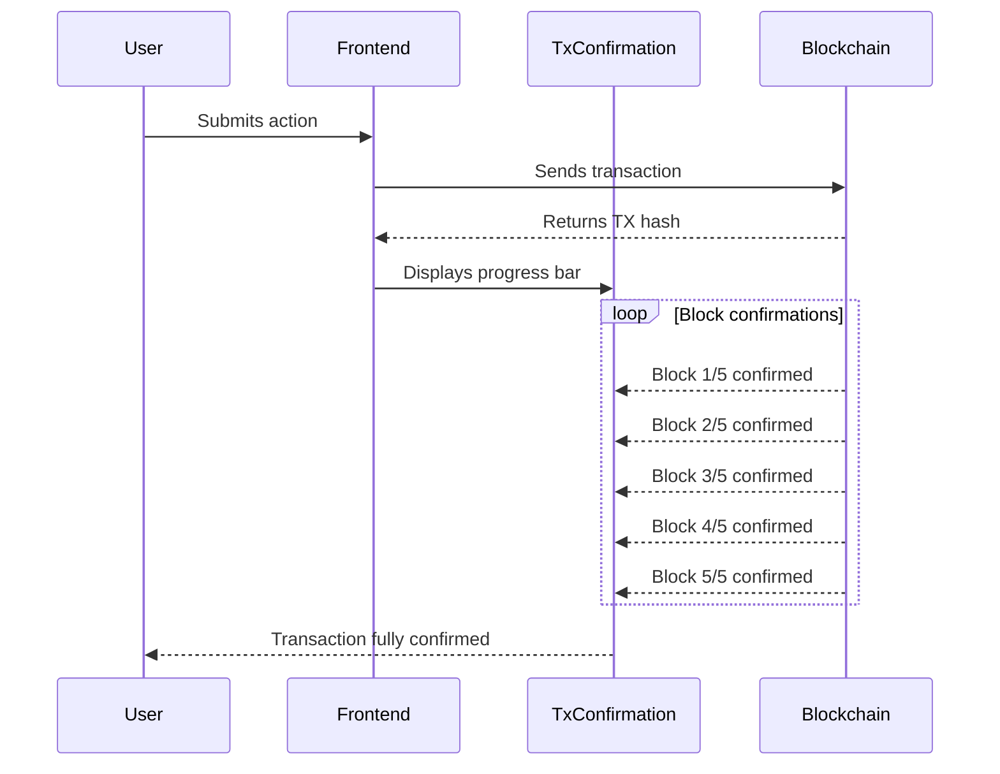

# Technical Flow Diagram — Contium

## Main User Flow



## Detailed Technical Flow

### 1. Document Upload

```
User                         Frontend (Browser)
  |                                |
  |  Selects file                  |
  | -----------------------------> |
  |                                |
  |                         [FileReader API]
  |                         Reads file into memory
  |                                |
  |  File loaded in memory         |
  | <----------------------------- |
```

The document never leaves the user's device. It is read into browser memory solely for hash computation.

### 2. Hash Generation

```
Frontend                     Web Crypto API
  |                                |
  |  crypto.subtle.digest()        |
  | -----------------------------> |
  |                                |
  |                         [SHA-256 Algorithm]
  |                         Produces 256-bit hash
  |                                |
  |  Hash (bytes32)                |
  | <----------------------------- |
  |                                |
  |  Example: 0x7a8b9c3d...       |
```

SHA-256 properties: irreversible (cannot reconstruct the document from the hash), unique (no two different documents produce the same hash), deterministic (same document always produces the same hash).

### 3. Register on Blockchain

```
Frontend              Pali Wallet            DocumentRegistry
  |                       |                        |
  |  registerDocument()   |                        |
  | --------------------> |                        |
  |                       |                        |
  |  Request signature    |                        |
  | <-------------------- |                        |
  |                       |                        |
  |  User confirms        |                        |
  | --------------------> |                        |
  |                       |   Signed TX            |
  |                       | ---------------------> |
  |                       |                        |
  |                       |                 [Stores:]
  |                       |                 - hash
  |                       |                 - owner address
  |                       |                 - timestamp
  |                       |                        |
  |                       |   TX receipt           |
  |                       | <--------------------- |
  |  Confirmation         |                        |
  | <--------------------------------------------- |
```

### 4. Document Validation

```
Frontend              Pali Wallet            DocumentRegistry
  |                       |                        |
  |  validateDocument()   |                        |
  | --------------------> |                        |
  |                       |   Signed TX            |
  |                       | ---------------------> |
  |                       |                        |
  |                       |                 [Checks:]
  |                       |                 - exists?
  |                       |                 - is owner?
  |                       |                 - already validated?
  |                       |                        |
  |                       |                 [Updates:]
  |                       |                 - validated = true
  |                       |                 - score += 10
  |                       |                        |
  |  Event emitted        |                        |
  | <--------------------------------------------- |
```

### 5. Mint Badge NFT

```
Frontend              Pali Wallet            ContiumBadge         DocumentRegistry
  |                       |                      |                      |
  |  mintBadge()          |                      |                      |
  | --------------------> |                      |                      |
  |                       |   Signed TX          |                      |
  |                       | -------------------> |                      |
  |                       |                      |                      |
  |                       |                      |  isValidated(hash)?  |
  |                       |                      | -------------------> |
  |                       |                      |                      |
  |                       |                      |  true                |
  |                       |                      | <------------------- |
  |                       |                      |                      |
  |                       |               [Mints ERC-721 NFT]          |
  |                       |                      |                      |
  |  NFT received         |                      |                      |
  | <------------------------------------------- |                      |
```

## Contract Architecture



## Transaction Confirmation Flow



---

Copyright 2025 Contium by ChainPort